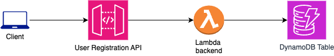

# Copilot Registration API

The **Copilot Registration API** facilitates the registration process for the GitHub Copilot usage tracker solution. It enables you to link your GitHub ID, Project ID, and Machine ID with your Copilot proxy. As the [GitHub Copilot Proxy](https://github.com/sidathasiri/copilot-proxy-server) only detects your device ID, this API allows you to map the device ID to your GitHub ID, ensuring accurate tracking. While the API can be used directly, registration is typically handled through the [Copilot Usage Analyzer tool](https://github.com/sidathasiri/copilot-usage-analyzer) for convenience.

## Overall Solution

The API is built as a RESTful service leveraging AWS API Gateway, Lambda functions, and DynamoDB to provide scalable and serverless registration functionality. The solution can be easily deployed on AWS using Terraform, ensuring an automated and efficient setup.

The infrastructure is defined using Terraform, allowing for the deployment of the API and associated resources, such as Lambda functions and DynamoDB tables.

## How to Use

To register with the API, send a `POST` request to the `/register` endpoint with the following payload:

- `githubId`: Your GitHub ID.
- `projectId`: The project you're working on.
- `machineId`: Your device's unique identifier.

This will map your device's ID to your GitHub ID and project within the tracking system.

## Setup Instructions

1. Run `npm install` to install all required dependencies.
2. Run `npm run package` to create a zip file of the Lambda handler implementation.
3. Create an S3 bucket for storing the Terraform backend state and update the configuration accordingly.
4. Deploy the solution using Terraform with the following commands:
   - `terraform init`
   - `terraform plan`
   - `terraform apply`

This will set up the infrastructure and deploy the registration API on AWS.